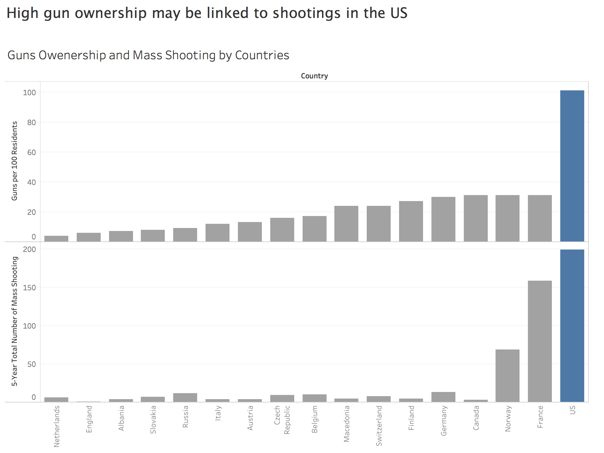

## 1.2 Finding 2: The United States’s stands out mass shooting frequency
### 1.2.1 Description:
In the provided article, discussion about mass public shooting was limited to the number and distribution of mass shooting in U.S. It did not give an worldwide comparison to illustrate how severe mass shooting is in US, so audience can not decide whether mass shooting is a US-unique issue or not. Therefore, it make sense to address mass shooting question by adding comparison to gauge severity of mass shooting. Besides, listing fact numbers of mass shooting gives no clue on what leads to severe mass shooting events or what measures may take to solve mass shooting, which is another limitation of original plots. The original plot supporting the claim that “On average, there is around one mass shooting for each day in America” also has limitation, it focus only on 2015, ignoring the possibility that 2015 might be a specific year that is not typical from other year.
To illustrate mass shooting issue better, I firstly made comparison among US, UK, Canada and some European countries to show how severe that issue is in US and then further checked the year and month distribution in an extended period.

Data Wrangling:
```{r}
library(data.table)
library(plotly)
library(ggplot2)
library(tm)

MS_dataset <- read_csv("Mass Shootings Dataset Ver 5.csv"
                              , col_types = cols(Date = col_date(format = "%m/%d/%Y")))
MS_dataset <- data.table(MS_dataset)

MS_dataset[,Month:=as.factor(month(Date))]
MS_dataset[,Year_n:=as.numeric(year(Date))]
MS_dataset[,Year:=as.factor(year(Date))]

plot_ly(data = MS_dataset
        ,type = 'scatter'
        ,mode = 'markers' 
        ,hoverinfo = 'text'
        ,x = ~Month
        ,y = ~Year
        ,size = ~`Total victims`
        ,alpha = 0.6
        ,text = ~paste("Location: ", Location
               ,'\n Date: ', Date 
               ,'\n Total victims : ', `Total victims` 
               ,'\n Fatalities : ', Fatalities
               ,'\n Injured : ', Injured)) %>% 
  layout(title = "Mass Shootings in US by years and month"
         , xaxis = list(title = "Month")
         , yaxis = list(title = "Years"))


f1 <- list(family = "Arial, sans-serif",size = 14,color = "grey")
f2 <- list(family = "Old Standard TT, serif",size = 12,color = "black")

# Axis settings
ax <- list(title = "Month",titlefont = f1,showticklabels = TRUE,tickangle = 0,tickfont = f2,exponentformat = "E")

ay <- list(title = "Year",titlefont = f1,showticklabels = TRUE,tickangle = 0,tickfont = f2,exponentformat = "E")

b1 <- list(text = "Total victims",font = f1,xref = "paper",yref = "paper",yanchor = "bottom",xanchor = "center",align = "center",x = 0.5,y = 1,showarrow = FALSE)

hm1 <- plot_ly(data = MS_dataset
        ,type = 'heatmap'
        ,colors = colorRamp(c("yellow", "blue", "darkred"))
        ,x = ~Month
        ,y = ~Year
        ,z = ~`Total victims`)%>%layout(showlegend = T
         , xaxis = ax
         , yaxis = ay
         , annotations = b1)
subplot(hm1)
```
### 1.1.2 The redesigned plot:
<!-- .element height="80%" width="80%" -->
<!-- .element height="80%" width="80%" -->

The upper plot tells us that the United States stands out among countries for the frequency with which its mass shootings occur and one variable that can explain the high rate of mass shootings in America is its astronomical number of guns. A country’s rate of gun ownership correlated with the odds it would experience a mass shooting(Adam Lankford, 2016)[2](https://www.ncbi.nlm.nih.gov/pubmed/26822013), even though there is only a few counties that have very high mass shooting records, we can still see such relationship by looking at Norway and France.

The plot also confirms the fact that there is no a high volume time for mass shooting, and therefore supports the opinion that “it will just about never be the right time to discuss gun control”. We can also conclude from the plot that mass shooting in US tends to be more severe and frequent, which should give alarm to local authorities.

### 1.2.3 Improvement from first version to revised version
The first version of redesigned:

Problems with this plot that I fixed in the revised version are:
- The most severe problem with this plot is that it uses unjustified variable, which is average frequency of mass shooting per million capita. Mass shooting is a very special issue and each event has influence over whole country, therefore  discussing mass shooting problem on a per capita basis just makes it seems less concerning and is misleading. Using per-existence rather than per-capita variable for mass shooting is more appropriate.
- The second problem is that the plot does not provide metrics to provide explanation. By adding gun-ownership rate, we could have more clue regarding what lead to mass shooting.
- Putting US besides the highest one is somehow deceptive

# 2 Deceptive Version

In this report, I chose three claim from the original article and their corresponding plots, which I think would generate misunderstandings when being illustrated in deceptive ways. The original plots and deceptive plots are using almost the same data source but are shown in either different dimensions or different metics.

## 2.1 Claim 1: America has six times as many firearm homicides as Canada, and nearly 16 times as many as Germany
### 2.1.1 From original plots to deceptive plots
Original Plot:
:format(webp)/cdn.vox-cdn.com/uploads/chorus_asset/file/10228297/gun_homicides_per_capita.jpg)<!-- .element height="50%" width="50%" -->

This plot intends to tell us how severe the firearm homicide is in US, compared with other developed countries. However, there are several problem with this plot.

- It does not provide explanation for choosing those 14 countries. As we know, there are 34 developed countries in the world and most of them have a compeletely different gun control situation from U.S..
- A huge part of developed countries have strict gun control. Therefore, directly making comparison of firearm homicide rate may be not make any sense.

<!-- .element height="50%" width="50%" -->

Here is plot from another point of view. When taking counties that have high gun ownerhship rate into consideration, we can see that even though US has been critized by its high gun ownership, it dose not ranks tops in both firearm homicide rate. Furthermore, when taking gun ownership rate into consideration, we can find that US still does not show up in terms of homicide to gun ownership rate. 

### 2.1.2 From first version to revised version
First version plot:

