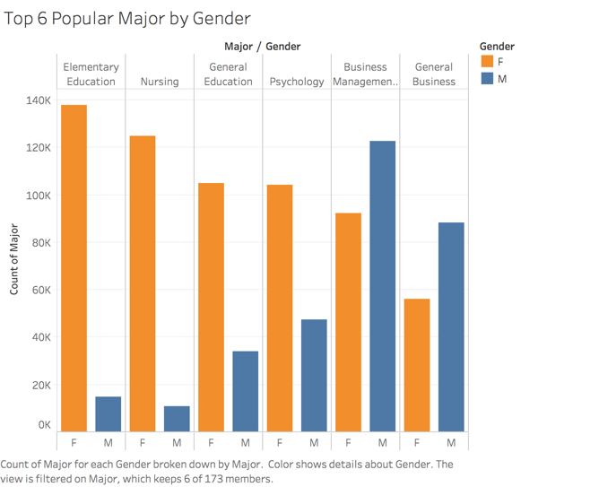

# First Version Team Project -- College Education
## Introduction 
This project is looking at college education related data to see how college education changes over time and how does it affect people. Specifically, we are looking at the following research questions:
1. What college majors are trending over years?
2. How does the most popular college majors vary across gender?
3. What is the relationship between college majors and occupations?
This document looks at the three research questions listed above and tries to find reasons behind them. 

## Data Source and Data Cleaning
Data used for the projects come from US Census Bureau and Centers for Disease Control and Prevention. Following are the data cleaning process to retrieve the information we need to answer the research questions.

Read and Combine Raw Data
```{r}
library(data.table)
census1 = fread('ss16pusa.csv')
census1 = census1[,c("ST","ADJINC","FOD1P","SCH","SCHG","SCHL","INDP","NAICSP","SEX","RAC1P","PINCP","AGEP","CITWP","COW","SERIALNO")]
census2 = fread('ss16pusb.csv')
census2 = census2[,c("ST","ADJINC","FOD1P","SCH","SCHG","SCHL","INDP","NAICSP","SEX","RAC1P","PINCP","AGEP","CITWP","COW","SERIALNO")]
census3 = fread('ss16pusc.csv')
census3 = census3[,c("ST","ADJINC","FOD1P","SCH","SCHG","SCHL","INDP","NAICSP","SEX","RAC1P","PINCP","AGEP","CITWP","COW","SERIALNO")]
census4 = fread('ss16pusd.csv')
census4 = census4[,c("ST","ADJINC","FOD1P","SCH","SCHG","SCHL","INDP","NAICSP","SEX","RAC1P","PINCP","AGEP","CITWP","COW","SERIALNO")]
census = rbind(census1, census2, census3, census4)
```
The research questions we looked at for the project are related to college education. As a result, we are removing the records that have missing values for the field of degree(FOD1P). 
```{r}
census = census[!is.na(census$FOD1P),]
```
In order to understand how popular majors change over years, it is essential to know when did a person attend college. This information is not provided in the data set. To get around with the problem, we make an assumption that people attend college at 18. By substrating the age of the respondent from the year the person took the survey and then add by 18, we will be able to get the year of the person attending college based on the assumption. The year of the survey is not explicitly provided in the data but we are able to get this information by taking the first four digits of the GQ person serial number (SERIALNO). 
```{r}
census$survey_year <-substr(census$SERIALNO,1,4)
census$survey_year <- as.numeric(census$survey_year)
census$college_year<-census$survey_year - census$AGEP + 18
census = census[,c("ST","ADJINC","FOD1P","SCH","SCHG","SCHL","INDP","NAICSP","SEX","RAC1P","PINCP","AGEP","CITWP","COW","survey_year", "college_year")]
```
Get State Name by Merging State FIP code
```{r}
state <- read.csv("us-state-ansi-fips.csv")
colnames(state)[2] <- "ST"
census <- merge(x = census, y = state, by = "ST", all.x = TRUE)
```
Income Inflation Adjusts
Since the dataset covers surveys from 2012 - 2016, it is necessary to adjust income so as to make them comparable. Using the adjusted factor for income and earnings(ADJINC), we are able to get the total peronal income to 2016 dollars. 
```{r}
census$income_2016 <- census$ADJINC*0.000001*census$PINCP
census = census[,c("ST","FOD1P","SCH","SCHG","SCHL","INDP","NAICSP","SEX","RAC1P","AGEP","COW","survey_year", "college_year", "stname", "stusps", "income_2016")]
```


## Finding 1:  Elementary Education, General Education, Business, Nursing and Psychology are the most popular majors from 1935 to 2008.
### Description: 
In this chart we show trend of top 6 majors over 80 years. Those majors can be divided into four category: Education, Business, Nursing and Psychology. From chart we can see the most popular major category during 1935 and 1970 is education, and it arrives peak in 1970; also though are not the most popular, psychology and nursing arrive their peak during 1961 and 1975; then it comes to business, between 1975 and 2000 two business majors increasing so fast that became top majors during those year and arrive their peaks in 1980; finally after 2000 psychology became the most popular major. 


Tableau Link: * https://public.tableau.com/profile/zhonghe.han#!/vizhome/Finding1_0/Dashboard1

### 1.1 Development Process: 
For we want to see trend of majors by year, here we use year as x axis and sum count of each majors as y axis. Since we have many majors, we chose top 6 majors that with most counts aggregated by 80 years.  The reason that we chose top 6 but not 5 is we found the sixth is nursing which can help explain trend of psychology, we will explain it later. 

### 1.2 Reasoning：
After found popular majors during years, we tried to find claims for them to explain why they are popular in specific time period. Finally we found why people choose some majors tie close to social and culture events during those years. 

1. From graph we can see education once was the most popular major for almost 40 years. Through reading essays we found investment in education had a huge increase after world war. According to those papers, recruitment difficulty of world war made America government feel the lack of popularity in education so after war both local and state government increase investment percentage of GDP on education.From chart below we can see two peaks in 1935 and 1970, and it increasing fast both from 1920 and 1940 which were exactly year after world war I and  Ⅱ. This can explain why education became most popular major during 1935 to 1970, for more school and opportunities in education field were created, it would be easier to find a job if people study education. [reference: https://ourworldindata.org/financing-education] 


2. During 1960 to 1975 we found nursing and psychology arrived their peaks. In history of America, during that time Vietnam war happened and hippie movement began. We thought at that time for wars happened frequently and army needed plenty people major in nursing, it make nursing a hot major. And also topics in that period were always related to art, religion, drugs, love and sex, in other words in Spiritual level, therefore people tend to learn themselves well and learning psychology became a quick path to do so. [references: https://www.history.com/topics/vietnam-war/women-in-the-vietnam-war] [https://ibizatimes.wordpress.com/2015/03/02/the-hippie-movement-was-a-psychological-operation/]

3. Business related majors arrive their peak and beat other majors significantly during 1970s. From historical articles we found America even the whole world came to stagflation and oil crisis in that period. At that time all industries entered their low ebbs and people try to learn business to know better of world economics to save their family as well as their companies. But after that business is always a popular major in university and even economy has recovered. We will explain this in later finding. 
[references: https://www.investopedia.com/articles/economics/08/1970-stagflation.asp]

4. Business kept its top one position until 21 century. More specific, it was surpassed by psychology in 2003. From 1999 psychology began increasing and arrived its peak in 2003. We noticed that in 2001 ‘September 11 attack’ happened in America, which hit American seriously. We felt this hurt American in both physical and mental level. From a dataset that show expenditures of people on mental health by year we found a turning point in 1998, after which spending on mental health increasing faster. We can see from chart below:

[references: https://www.cdc.gov/nchs/hus/contents2016.htm#mentalhealth]

## Finding 2:  Male and female are remarkably different in choosing their college majors, as a result, there is wage gap between gender.



### 2.1 Description
College education is a major investment in lifetime. Women increasingly participated in college education over years, and the total number of women’s degree holders outweighed the total number of men’s since 1980s (cite, need graph?). However, in term of major preference, male and female were remarkably different: female students were more likely to choose Elementary/General Education and Nursing as their majors, while male students prefered Business-related majors, as showed in the graph above. As a result, there is a wage gap between genders because most men choose to major in the higher-income field of studies.

### 2.2 Development Process
After looking the overall popular majors, we explored the top 6 popular majors between genders. To explore major preference in gender, we grouped the processed data file (“census_final + merge with major_category”) by major and gender to summarize count of major. We choose the top 6 popular majors  in total counts to analyze since it’s consistent with the previous finding, and we think it’s worth to further explore the most popular majors in the perspective of gender.

### 2.3 Explanation and Impacts on Wage Gap
According to the Staff Report of Federal Reserve Bank of New York, gender difference in choosing majors could be explained by two factors: innate abilities and diverge preferences (Zafar 2009). More specifically, when considering major options, female student pay much attention to non-pecuniary outcomes, such as gaining approval of parents and enjoying work at jobs, while male students emphasize pecuniary outcomes, namely social status of the jobs, likelihood of finding a job, and earnings profiles at future jobs (2009). As a result, “differences in major account for a substantial part of the gender gap in the earnings of individuals with several years of college education” (2009 ).
The literature is consistent with what we are finding. From the data, we generated the average mean income by specialized category of majors (which aggregated 170 majors into 15 border categories by ACS) during early as well as mid career phase. Also, we highlighted the general category into four colors as legends.  From the graph, we concluded that major in the field of science and engineering, and business would generate higher income than majoring in the field of education and liberal arts during early career: the mean income for engineering major students is around $50,000 while for education major students is only about $32,000 during early career. 


The income gap became even wider when analyzing the mid-career income by majors (graph): major in education is the lowest category in term of mid-career income levels, while students major in engineering increased their income more than double.


Combining with our finding 2 that women prefered major in lower-earning field, such as Education, while men concentrated in higher-earning field of majors, we can easily conclude that gender difference in major is one of driver for gender income gap.

## Finding 3: Business-related majors are popular over the years since business graduates can work in a wider variety of occupations.

