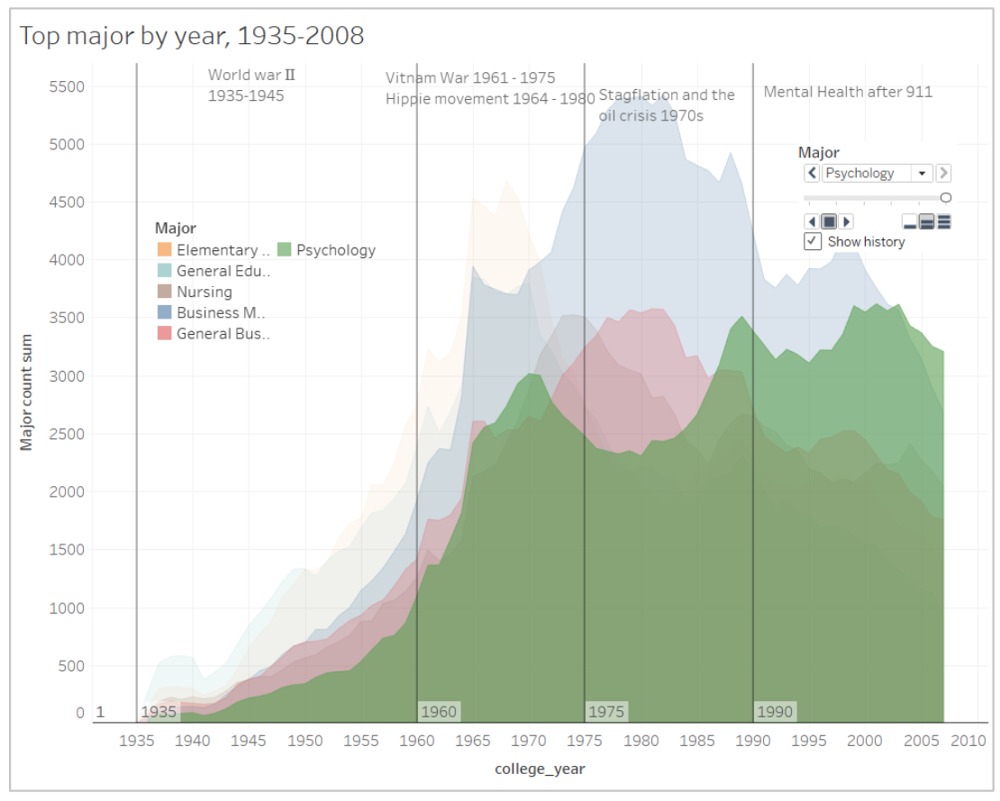
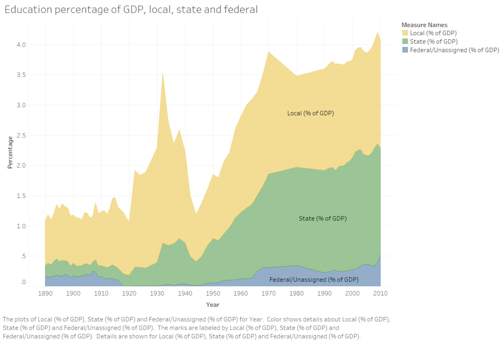
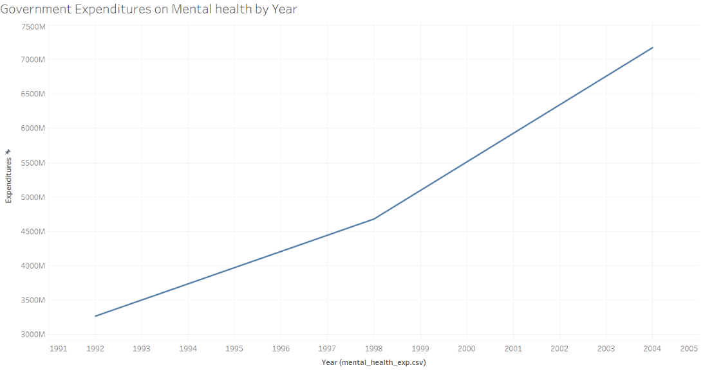

## First Version for Team Project

### Introduction

### Data Source and Cleaning

### Finding 1:  Elementary Education, General Education, Business, Nursing and Psychology are the most popular majors from 1935 to 2010
*Description: *
In this chart we show trend of top 6 majors over 80 years. Those majors can be divided into four category: Education, Business, Nursing and Psychology. From chart we can see the most popular major category during 1935 and 1970 is education, and it arrives peak in 1970; also though are not the most popular, psychology and nursing arrive their peak during 1961 and 1975; then it comes to business, between 1975 and 2000 two business majors increasing so fast that became top majors during those year and arrive their peaks in 1980; finally after 2000 psychology became the most popular major. 

*Tableau Link: * https://public.tableau.com/profile/zhonghe.han#!/vizhome/Finding1_0/Dashboard1

*Development Process: *
For we want to see trend of majors by year, here we use year as x axis and sum count of each majors as y axis. Since we have many majors, we chose top 6 majors that with most counts aggregated by 80 years.  The reason that we chose top 6 but not 5 is we found the sixth is nursing which can help explain trend of psychology, we will explain it later. 

*Reasoning：*
After found popular majors during years, we tried to find claims for them to explain why they are popular in specific time period. Finally we found why people choose some majors tie close to social and culture events during those years. 

1. From graph we can see education once was the most popular major for almost 40 years. Through reading essays we found investment in education had a huge increase after world war. According to those papers, recruitment difficulty of world war made America government feel the lack of popularity in education so after war both local and state government increase investment percentage of GDP on education.From chart below we can see two peaks in 1935 and 1970, and it increasing fast both from 1920 and 1940 which were exactly year after world war I and  Ⅱ. This can explain why education became most popular major during 1935 to 1970, for more school and opportunities in education field were created, it would be easier to find a job if people study education. [reference: https://ourworldindata.org/financing-education] 

2. During 1960 to 1975 we found nursing and psychology arrived their peaks. In history of America, during that time Vietnam war happened and hippie movement began. We thought at that time for wars happened frequently and army needed plenty people major in nursing, it make nursing a hot major. And also topics in that period were always related to art, religion, drugs, love and sex, in other words in Spiritual level, therefore people tend to learn themselves well and learning psychology became a quick path to do so. [references: https://www.history.com/topics/vietnam-war/women-in-the-vietnam-war] [https://ibizatimes.wordpress.com/2015/03/02/the-hippie-movement-was-a-psychological-operation/]

3. Business related majors arrive their peak and beat other majors significantly during 1970s. From historical articles we found America even the whole world came to stagflation and oil crisis in that period. At that time all industries entered their low ebbs and people try to learn business to know better of world economics to save their family as well as their companies. But after that business is always a popular major in university and even economy has recovered. We will explain this in later finding. 
[references: https://www.investopedia.com/articles/economics/08/1970-stagflation.asp]

4. Business kept its top one position until 21 century. More specific, it was surpassed by psychology in 2003. From 1999 psychology began increasing and arrived its peak in 2003. We noticed that in 2001 ‘September 11 attack’ happened in America, which hit American seriously. We felt this hurt American in both physical and mental level. From a dataset that show expenditures of people on mental health by year we found a turning point in 1998, after which spending on mental health increasing faster. We can see from chart below:

[references: https://www.cdc.gov/nchs/hus/contents2016.htm#mentalhealth]

### Finding 2:  Male and female are remarkably different in choosing their college majors, as a result, there is wage gap between gender.

