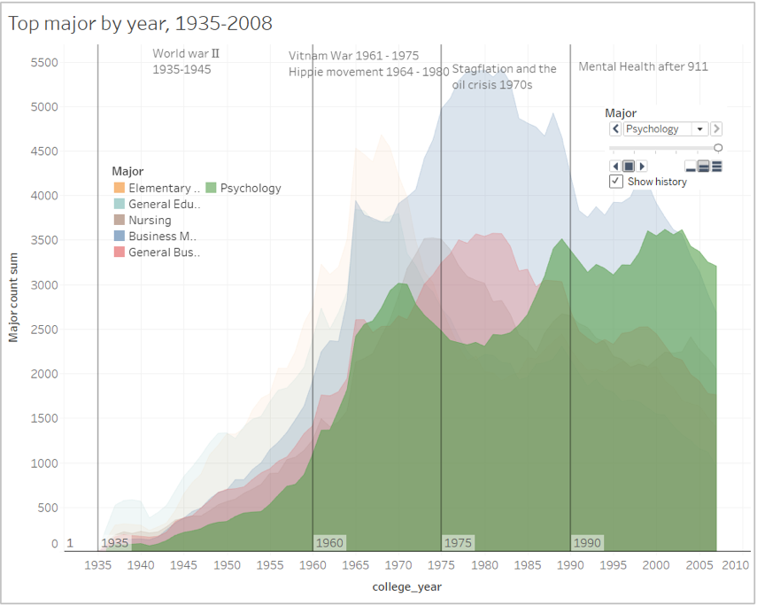
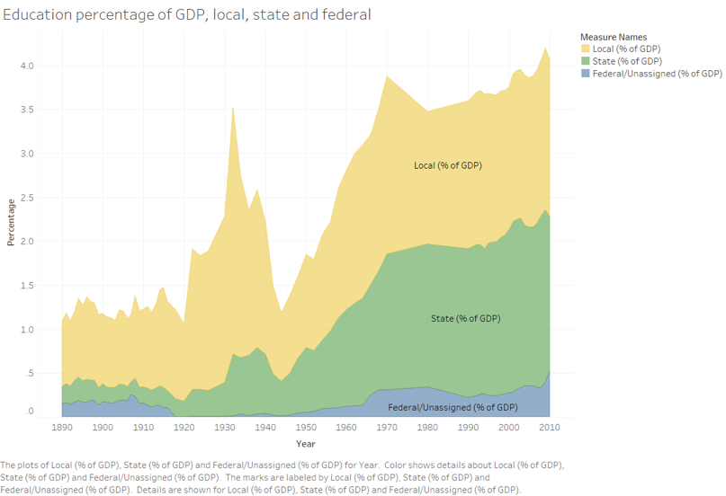
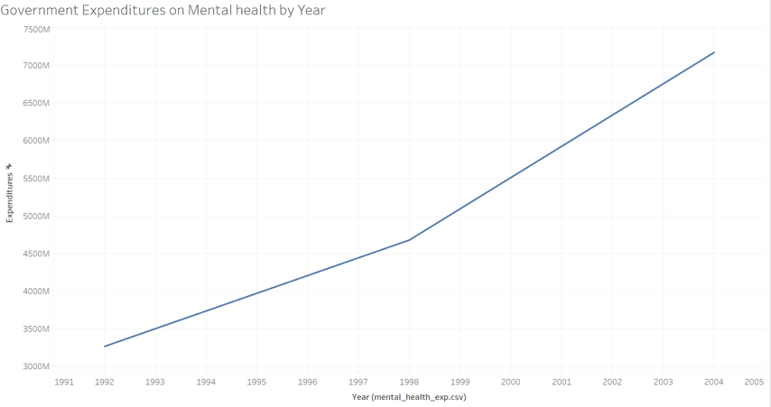
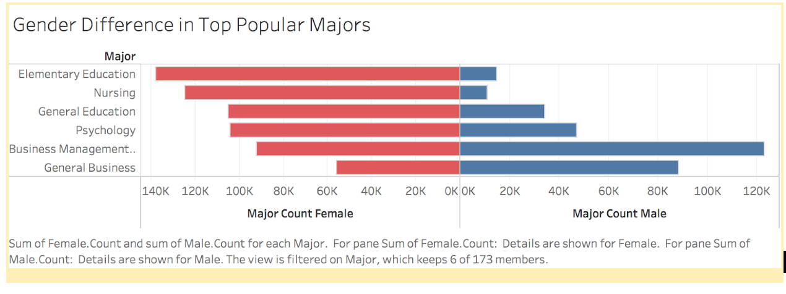
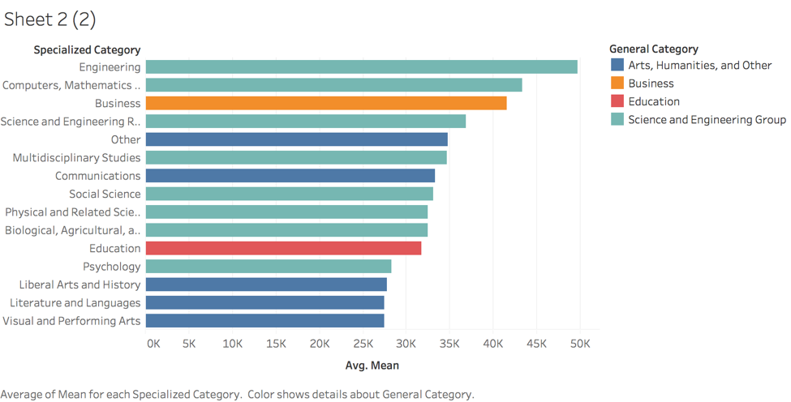
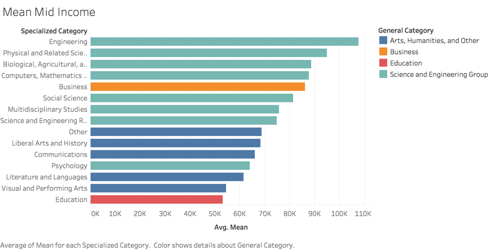
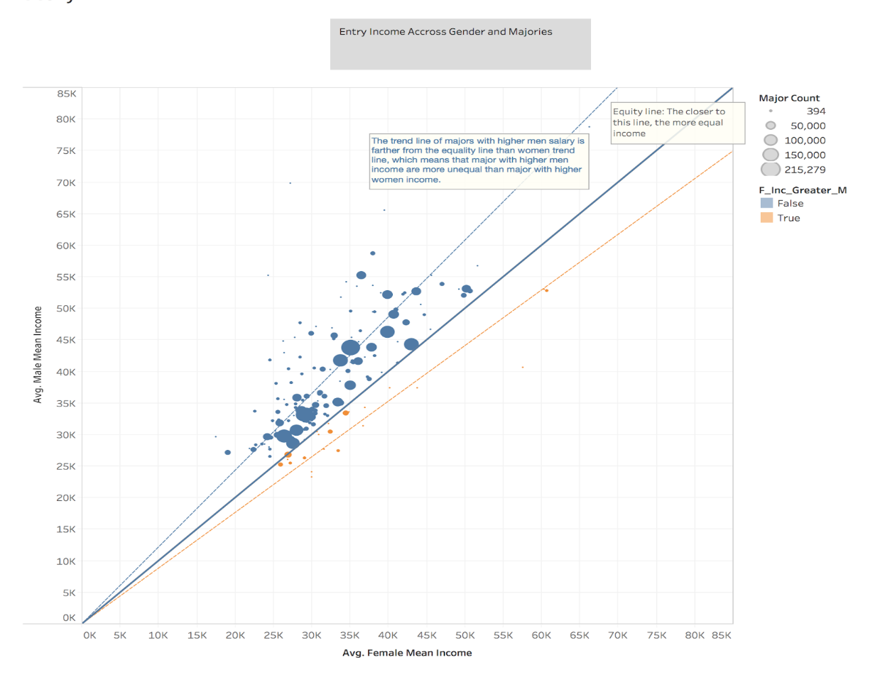
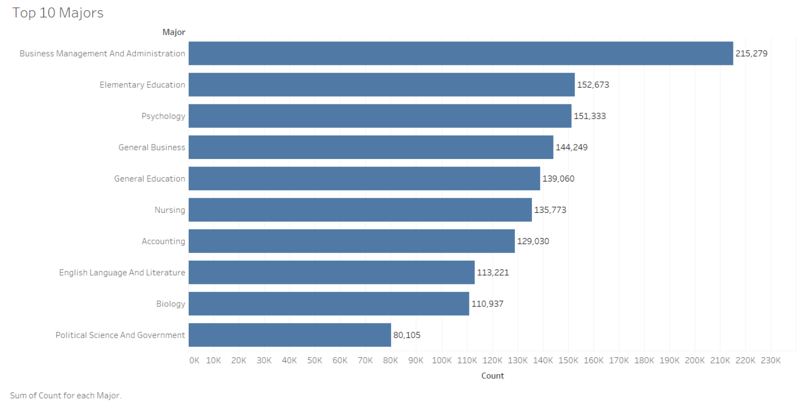

# First Version Team Project -- College Education
## Author: Zhonghe Han, Tianmi Li, Yingjie Yu, Feng Wang, Jieyi Deng
## Introduction 
This project is looking at college education related data to see how college education changes over time and how does it affect people. Specifically, we are looking at the following research questions:
1. What college majors are trending over years?
2. How does the most popular college majors vary across gender?
3. What is the relationship between college majors and occupations?
This document looks at the three research questions listed above and tries to find reasons behind them. 

## Data Source and Data Cleaning
Data used for the projects come from US Census Bureau and Centers for Disease Control and Prevention. Following are the data cleaning process to retrieve the information we need to answer the research questions.

Read and Combine Raw Data
```{r}
library(data.table)
census1 = fread('ss16pusa.csv')
census1 = census1[,c("ST","ADJINC","FOD1P","SCH","SCHG","SCHL","INDP","NAICSP","SEX","RAC1P","PINCP","AGEP","CITWP","COW","SERIALNO")]
census2 = fread('ss16pusb.csv')
census2 = census2[,c("ST","ADJINC","FOD1P","SCH","SCHG","SCHL","INDP","NAICSP","SEX","RAC1P","PINCP","AGEP","CITWP","COW","SERIALNO")]
census3 = fread('ss16pusc.csv')
census3 = census3[,c("ST","ADJINC","FOD1P","SCH","SCHG","SCHL","INDP","NAICSP","SEX","RAC1P","PINCP","AGEP","CITWP","COW","SERIALNO")]
census4 = fread('ss16pusd.csv')
census4 = census4[,c("ST","ADJINC","FOD1P","SCH","SCHG","SCHL","INDP","NAICSP","SEX","RAC1P","PINCP","AGEP","CITWP","COW","SERIALNO")]
census = rbind(census1, census2, census3, census4)
```
The research questions we looked at for the project are related to college education. As a result, we are removing the records that have missing values for the field of degree(FOD1P). 
```{r}
census = census[!is.na(census$FOD1P),]
```
In order to understand how popular majors change over years, it is essential to know when did a person attend college. This information is not provided in the data set. To get around with the problem, we make an assumption that people attend college at 18. By substrating the age of the respondent from the year the person took the survey and then add by 18, we will be able to get the year of the person attending college based on the assumption. The year of the survey is not explicitly provided in the data but we are able to get this information by taking the first four digits of the GQ person serial number (SERIALNO). 
```{r}
census$survey_year <-substr(census$SERIALNO,1,4)
census$survey_year <- as.numeric(census$survey_year)
census$college_year<-census$survey_year - census$AGEP + 18
census = census[,c("ST","ADJINC","FOD1P","SCH","SCHG","SCHL","INDP","NAICSP","SEX","RAC1P","PINCP","AGEP","CITWP","COW","survey_year", "college_year")]
```
Get State Name by Merging State FIP code
```{r}
state <- read.csv("us-state-ansi-fips.csv")
colnames(state)[2] <- "ST"
census <- merge(x = census, y = state, by = "ST", all.x = TRUE)
```
Income Inflation Adjusts
Since the dataset covers surveys from 2012 - 2016, it is necessary to adjust income so as to make them comparable. Using the adjusted factor for income and earnings(ADJINC), we are able to get the total peronal income to 2016 dollars. 
```{r}
census$income_2016 <- census$ADJINC*0.000001*census$PINCP
census = census[,c("ST","FOD1P","SCH","SCHG","SCHL","INDP","NAICSP","SEX","RAC1P","AGEP","COW","survey_year", "college_year", "stname", "stusps", "income_2016")]
```


## Finding 1:  Elementary Education, General Education, Business, Nursing and Psychology are the most popular majors from 1935 to 2008.


Tableau Link: https://public.tableau.com/profile/zhonghe.han#!/vizhome/Finding1_0/Dashboard1
### 1.1 Description: 
This chart shows the trends of top 6 majors over 80 years from 1935 to 2008. These majors can be classified into four categories, including Education, Business, Nursing and Psychology. From the chart we can see that the most popular major between 1935 and 1970 was Elementary Education, with a peak at 4,681 in 1968. Majors such as Nursing and Psychology reached the local peaks in 1970 and 1973 respectively. From 1975 to 2000, two business majors gained large popularities fastly and became the top two majors in this period with their peaks in early 1980s. Starting early 2000s, Psychology gradually became the most popular major. 

### 1.2 Development Process: 
To understand the popularity trend of majors over years, we use year as x-axis and frequency of responders’ college major as y-axis. Since we have many majors, we chose the top six majors and counted the frequency for each major by year. We chose top six instead of top five because we found the sixth is Nursing, which can help explain the trend of psychology as well (detailed explanation will be provided below).

### 1.3 Reasoning：
After found popular majors during years, we tried to find claims for them to explain why they are popular in specific time period. Finally we found why people choose some majors tie close to social and culture events during those years. 

1. From the graph, we saw that Elementary/General Education had been the most popular major for almost 40 years. One possible explanation is that there was a huge increase in investment on education after World War I & II.  According to the research produced by the Oxford Martin Programme at Oxford University, recruitment difficulty of world war made the US government feel the lack of popularity in education, so after war both local and state governments increased investment on education (Max and Esteban, 2018). From chart below, we can see two peaks in 1935 and 1970, and it growthly increased after 1920 and after 1940, which were the exactly years after World War I and II. This can explain why education became the most popular major between 1935 and 1970: for more school and opportunities in education field were created, it would be easier to find a job if people studied in education. [1](https://ourworldindata.org/financing-education)



Source: Financing Education

2. During 1960 to 1975, Nursing and Psychology majors arrived their peaks when Vietnam War happened and hippie movement began. During that time, Nursing become a hot major because wars happened frequently, and army needed plenty of people who skilled at nursing. According to History.com Staff, the Vietnam Women’s Memorial Foundation estimates that approximately 11,000 military women were stationed in Vietnam during the conflict. Nearly all of them were volunteers, and 90 percent served as military nurses (History.com Staff, 2011)[2](https://www.history.com/topics/vietnam-war/women-in-the-vietnam-war)Also topics in that period were always related to art, religion, drugs, love and sex, in other words in Spiritual level. Therefore, people tend to learn themselves well and studying psychology became a quick path to do so. From an issue published by Ibiza Times in 2015, we knew that the Psyop was a response from the US government agencies to neutralize the anti-war movement that existed in universities among Academics and students. (Ibiza Times, 2015)[3](https://ibizatimes.wordpress.com/2015/03/02/the-hippie-movement-was-a-psychological-operation/)

3.  Business related majors arrived their peaks and beat other majors significantly during 1970s. During that time, oil crisis occurred, and the America or even the whole world came to stagflation. All industries entered their low ebbs and people tried to study business to better know world economy to save their families as well as their companies. However, business has always been a popular major even after economy was recovered. We will explain this in later finding. In 2017, Barry Nielsen said When people think of the U.S. economy in the 1970s the following things come to mind: High oil prices, Inflation, Unemployment, Recession.When people think of the U.S. economy in the 1970s the following things come to mind: High oil prices, Inflation, Unemployment, Recession. In December 1979, the price per barrel of West Texas Intermediate crude oil topped $100 (in 2016 dollars) and peaked at $117.71 the following April. That price level would not be exceeded for 28 years. (Barry Nielsen, 2017) [4](https://www.investopedia.com/articles/economics/08/1970-stagflation.asp)

4. Business had been the most popular major until 21st  century. More specific, it was surpassed by psychology in 2003. Starting from 1999, psychology major grew so fast  and arrived its peak in 2003. In 2001 ‘September 11 attack’ happened in the America, which hit Americans hard in both physical and mental level. According to  National Center for Health Statistics, people expenditures on Mental health increasing after 1998, which we thought explain why people tend to study psychology and psychology field boom fast[5](https://www.cdc.gov/nchs/hus/contents2016.htm#mentalhealth) We can see from chart below:

Source: National Center for Health Statistics

## Finding 2:  Male and female are remarkably different in choosing their college majors, as a result, there is wage gap between gender.


This graph presents the total count of the top six majors divided by gender, public file link:
https://public.tableau.com/profile/feng.wang2440#!/vizhome/Gender_Difference_in_Majors/Sheet1

### 2.1 Description
College education is a major investment in lifetime. Women increasingly participated in college education over years, and the total number of women’s degree holders outweighed that of men’s since 1980s (Perry, 2017). However, in term of major preference, male and female were remarkably different: female students were more likely to choose Elementary/General Education as well as  Nursing as their majors, while male students prefered Business-related majors, as showed in the graph above. As a result, there is a gender pay gap since most men choose to major in higher-income fields of studies.

### 2.2 Development Process
After looking the overall popular majors, we explored the top six popular majors between gender. To explore major preference in gender, we grouped the processed data file by major and  by gender to summarize total count of majors. We choose the top six popular majors  in total count because of consistent with the previous finding, and we think it’s worth to further research the most popular majors in the perspective of gender.

### 2.3 Explanation and Impacts on Wage Gap
According to the Staff Report of Federal Reserve Bank of New York, gender difference in choosing majors could be explained by two factors: “innate abilities and diverge preferences” (Zafar 2009). More specifically, when considering major options, female students pay much attention to non-pecuniary outcomes, such as gaining approval of parents and enjoying work at jobs, while male students emphasize on pecuniary outcomes, namely social status of the jobs, likelihood of finding a job, and earnings profiles at future jobs (2009). As a result, “differences in major account for a substantial part of the gender gap in the earnings of individuals with several years of college education” (2009).

The report is consistent with our finding. From the data, we generated the average mean income by specialized category of majors (which aggregated 170 majors into 15 border categories by ACS) during early as well as mid career phase. Also, we highlighted the general category of major into four colors as legends. We concluded that majoring in the fields of science , engineering, and business would generate higher income than majoring in the fields of education and liberal arts during early career: the mean income for engineering students was around $50,000 while the education students was only about $32,000. 



The graph shows average income in early career  among specialized categories of major, link:

The income gap became much wider when analyzing the mid-career average income by majors: major in education was the lowest category in term of mid-career income levels, while students major in engineering increased their income more than double.


The graph shows average income in mid career era among specialized categories of major, link:

Combining with our finding two that women prefered major in lower-earning fields, such as Education, while men concentrated in higher-earning fields, we could easily conclude that gender difference in major was one of driver for gender pay gap as shown in following graph.


The graph represent early career average income between gender and over majors, the middle line (45% degree) is a equity line, which means the closer to this line, the more equal income, the blue dash line and orange dash line are trend line in each group: blue group means female income is less than male income in same major, and vice versa in orange line.

## Finding 3: Business-related majors are popular over the years since business graduates can work in a wider variety of occupations.

### 3.1 Description


This graph presents the total count of the top ten majors over the past 8 decades. 

This graph shows the distribution of occupations for the top ten majors.

The graphs can be viewed on Tableau Public: https://public.tableau.com/profile/jieyi.deng3205#!/vizhome/major_and_occupation/OccupationforTop10Majors?publish=yes
### 3.2 Development Process
Based on the Finding #1, business-related majors are quite popular over the past few decades, no matter whether there is a recession or not. To explore the reason why business majors are favored by so many people, we look at the occupations of college graduates for the top 10 majors. For clarity, we only select those industries with more than 2,000 people worked in for each major and omit minor categories. Each stacked bar represents a major with different colors for corresponding occupations. The full title for each category is listed below:

Abbreviation | Full Title
-------------| -------------
MFG | Manufacturing
SCA | Social Assistance 
ENT | Entertainment
CON | Construction
ADM | Public Administration
FIN | Finance, Insurance, Real Estate, Rental and Leasing
PRF | Professional, Scientific, and Management Services
MED | Health Care
EDU | Educational Services

### 3.3 Data Wrangling

```{r}
edu = fread('census_final.csv')
major = fread('major_code.csv')
names(major) <- c('major_code','major')
occupation <- fread('NAICSP.csv')
occupation <- occupation[,c(1,2)]
names(occupation)<-c('occupation_code','occupation')
occupation=separate(data=occupation,col = 2, into = c("occupation", "occu"), sep = "\\-")
```
```{r}
top_major <- edu %>% group_by(FOD1P)%>% summarize(n=n()) %>%arrange(desc(n))
top_major<- top_major[1:10,1]

tmp<- edu %>% group_by(FOD1P,NAICSP) %>% summarize(n=n()) %>%filter(!is.na(NAICSP))%>%filter(FOD1P %in% top_major$FOD1P )

names(tmp)<-c('major_code','occupation_code','count')

tmp <- merge(tmp,major, by = 'major_code')
tmp <- merge(tmp,occupation, by  = 'occupation_code')%>%filter(occupation_code>0)%>%filter(count>2000)
```

### 3.4 Reasoning
There are three business-related fields of study in top ten majors, including Business Management and Administration, General Business and Accounting. Graduates from Nursing, Elementary Education, General Education and Biology are concentrated in one or two industries, while those who studied business in college tend to have a wider variety in choosing occupations. 

This could be explained by the common sense that almost every company or institution will hire business-major graduates to manage funds, initiate marketing and promotion, and maintain efficient operation. Thus, business graduates are not only in need in industries that provide financial and consulting services, but also in almost all other fields such as health care, entertainment, construction, education and etc. In contrast, people major in Nursing and Education are trained more career-oriented that the occupations they take are restricted in the area of healthcare and educational service respectively. This may be the reason why business and management degrees are so popular in the U.S. over the past eight decades as such majors open doors to more careers than other undergraduate majors.

## Detours and Future Improvements:
### Detours
1. When try to find reasons for popular majors by year, at first we feel reason for different year period maybe same one, such as income. However when we went deeply of data, we found our society and humanity are more complicated than we thought. Then we found motivation for people to choose major are tight tie to social background. Therefore we explained them separately. 

2. At first we think people want to learn business related major were because high payment or unemployment. But in dataset we found, income in business field was even below average in that year (Andrea Koncz, 2016)[6](https://www.wallstreetprep.com/knowledge/salary-and-unemployment-rate-by-college-major/)Also unemployment rate of business field were almost same as average rate, no clear superiority showed (Wall Street Prep)[7](http://www.naceweb.org/job-market/compensation/salary-trends-through-salary-survey-a-historical-perspective-on-starting-salaries-for-new-college-graduates/)Then we found reasons for people study business were multiple complex. Here we only show the most dominant one but we can see even after stagflation business was still hot. After read papers, we think this still related to reasons such as baby boom period, degree of difficulty and maybe wide occupation choices after graduate. 

### Improvement 
1. For finding one, we see overall view by year. We still want to explore popular majors by states and to get a more macro view.
2. For finding one, we see there is a sharpy increase of popularity for all majors since late 1950s. This might be explained by the demographic cohort of baby boomers with birth years starting from mid-1940s to 1960 and higher birth rates within this period. We will explore more literatures in the revised version to dig into the reasons.   
3. For finding two, we see the income difference by majors/specialized majors, but not separate by gender. We will analyze income difference by major and by gender in the future. In addition, we find that the total number of women majoring in science, technology, and mathematics are very close to the total number of men majoring in these fields. The only difference in STEM field is engineering. Related to the recent movement that promoting women working in STEM industry, we wonder if there are relation between women major in STEM and women work in STEM.
4. For finding three, we claim business-related majors keep being popular over years by showing career choices for the 10 most majors and concentrate on occupation variety for those major. In order to figure out reason, we could take more factor into consideration, such as  income stability, income level, and salary and major gap between male and female.
5. The stacked bar chart in finding three is not as clear as other graphs to present the idea. Except for the color differences that shows the occupation differences for majors, it is hard to compare the actual numbers of the length for each color. We will improve the graph in the revised version.

## References:
1. Max Roser and Esteban Ortiz-Ospina (2018) - "Financing Education". 
https://ourworldindata.org/financing-education

2. History.com Staff (2011) -  Women in the Vietnam war. 
https://www.history.com/topics/vietnam-war/women-in-the-vietnam-war

3. Ibiza Times (2015) - ‘The Hippie movement was a Psychological Operation’. 
https://ibizatimes.wordpress.com/2015/03/02/the-hippie-movement-was-a-psychological-operation/

4. Barry Nielsen (2017) - ‘Stagflation, 1970s Style’
https://www.investopedia.com/articles/economics/08/1970-stagflation.asp

5. National Center for Health Statistics - ‘Health, United States, 2016 - Individual Charts and Tables: Spreadsheet, PDF, and PowerPoint files’.
https://www.cdc.gov/nchs/hus/contents2016.htm#mentalhealth

6. Wall Street Prep - ‘Salary and unemployment rate, by college major’.
https://www.wallstreetprep.com/knowledge/salary-and-unemployment-rate-by-college-major/

7. Andrea Koncz (2016) - ‘Salary trends through salary survey’.
http://www.naceweb.org/job-market/compensation/salary-trends-through-salary-survey-a-historical-perspective-on-starting-salaries-for-new-college-graduates/

8. Perry M.(2017). Table of the day: Bachelor’s degrees by field and gender for the Class of 2015. AEI
http://www.aei.org/publication/table-of-the-day-bachelors-degrees-by-field-and-gender-for-the-class-of-2015/

9. Zafar B. (2009). College major choice and the gender gap, Staff Report, Federal Reserve Bank of New York, No. 364, Federal Reserve Bank of New York, New York, NY. Retrieved https://www.newyorkfed.org/medialibrary/media/research/staff_reports/sr364.pdf  
